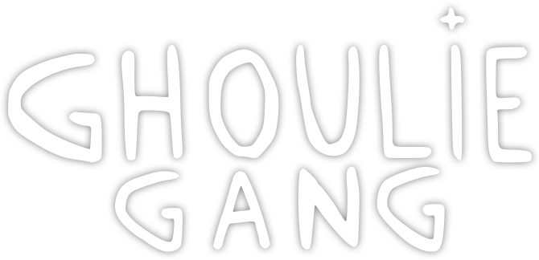

### GHOULIE GANG

Ghoulie Gang is a multi-season generative collection of 7,500 unique NFTs on the Solana blockchain. Creepy, weird, and unique just like each one of us.

Visit us at [ghouliegang.io](https://ghouliegang.io)



---

### Instructions

Step 1. `git clone git@github.com:ghoul-keeper/ghoulies.git`

Step 2. `cd ghoulies`

Step 3. `touch .env`

Step 4. Use these example values(I made a simple Candy Machine example). Eventually use your own Candy Machine information.

```
NEXT_PUBLIC_REACT_APP_CANDY_MACHINE_CONFIG="EKxeACaWUotEs7SRXzmJmPVTW9AbRycK5DsEzBVHH8nK"
NEXT_PUBLIC_REACT_APP_CANDY_MACHINE_ID="AQnYg2wGVhYmb14crar8EbFzkAbA8pZZQfXxwK1Cq6QY"
NEXT_PUBLIC_REACT_APP_CANDY_START_DATE=1634754.3
NEXT_PUBLIC_REACT_APP_SOLANA_NETWORK="mainnet-beta"
NEXT_PUBLIC_REACT_APP_SOLANA_RPC_HOST="https://api.mainnet-beta.solana.com"
NEXT_PUBLIC_REACT_APP_TREASURY_ADDRESS="BSPcExiygEBPgpiSFq6hena1qtcGLytyR6AzkpByctEa"
REDIS_URL=""
```

Step 5. `npm install`

Step 6. `npm run dev`

---

### The Team

- [@ghoulareyou](https://twitter.com/ghoulareyou)
- [@2ghoul4school](https://twitter.com/GrouchyGhoulie)
- [@ghoul_keeper](https://twitter.com/ghoul_keeper)
- [@fiatbrain](https://twitter.com/fiatbrain)
- [@hicryptopete](https://twitter.com/hicryptopete)
